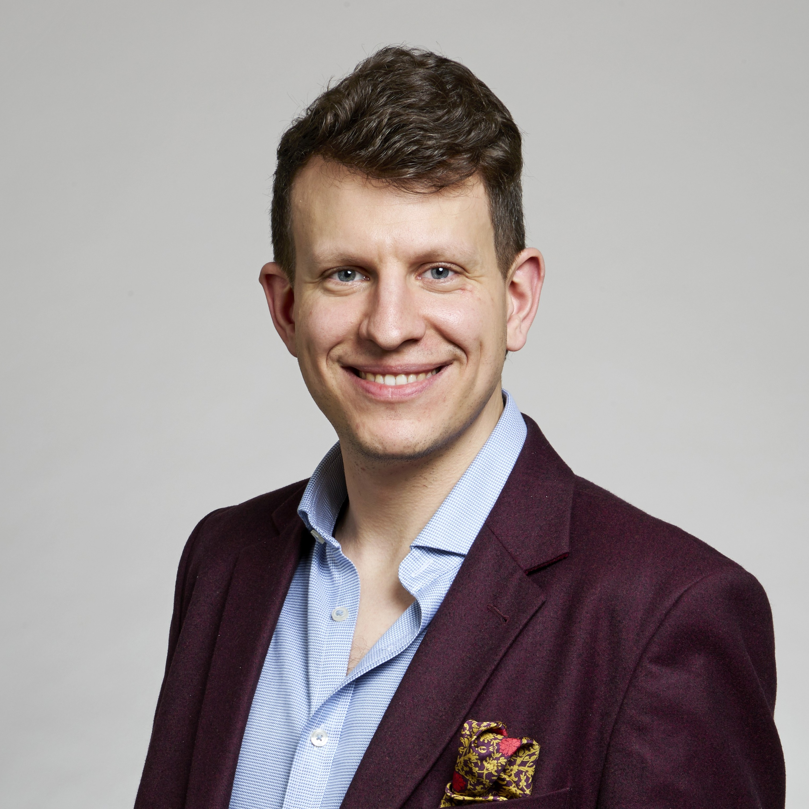

# Current group members

## Principal Investigator

{ .member-photo }
### Dr Filip Szczypiński [:fontawesome-brands-orcid:](https://orcid.org/0000-0003-3174-8532) [:fontawesome-solid-graduation-cap:](https://scholar.google.co.uk/citations?user=DJLqVIEAAAAJ)

*Royal Society University Research Fellow (2025 – now)*   
*Assistant Professor of Chemistry Automation (proleptic)*

Filip Szczypiński is a Royal Society University Research Fellow and Assistant Professor of Chemistry Automation at Durham University, which he joined in 2025.
He studied Natural Sciences at the University of Cambridge, where he investigated host–guest interactions in the group of Prof. Jonathan Nitschke.
He stayed on at Cambridge for his PhD with Prof. Chris Hunter FRS, exploring molecular recognition through programmed hydrogen-bonding interactions.
He then held postdoctoral positions in computational chemistry at Imperial College London (with Prof. Kim Jelfs) and in robotic chemistry at the University of Liverpool (with Prof. Andy Cooper FRS).

Filip’s research combines laboratory automation, high-throughput experimentation, and data-driven approaches to accelerate the discovery and development of functional molecules and materials.
His main focus is on bridging computational design with experimental execution, particularly in supramolecular and physical organic chemistry.
He has contributed to the development of autonomous robotic platforms for chemical synthesis, moving beyond reaction optimisation toward the discovery of previously unknown molecules.

Outside the lab, Filip enjoys travelling, food (eating, cooking, growing), and wine.
He has been seen organising tasting sessions, giving talks on wine chemistry, and competing in blind wine tasting around the world.

## Masters students

{ .member-photo }

### Guiling Wei
*Master of Data Science Student (2025)*

Guiling completed her undergraduate studies at Tianjin Foreign Studies University and previously worked in the manufacturing industry. She's interested in machine learning, as well as text mining, web scraping, and data visualization, especially in the context of real-world applications of predictive modelling and data-driven research. She has joined the group in 2025 for her data science research project, in which she is investigating new digital representations of molecules that are suitable for predictive machine learning applications.

## PhD students

{ .member-photo }

### This Could Be You
*PhD Student (now – soon)*

Get in touch if you are excited about data-driven discovery in chemistry!

